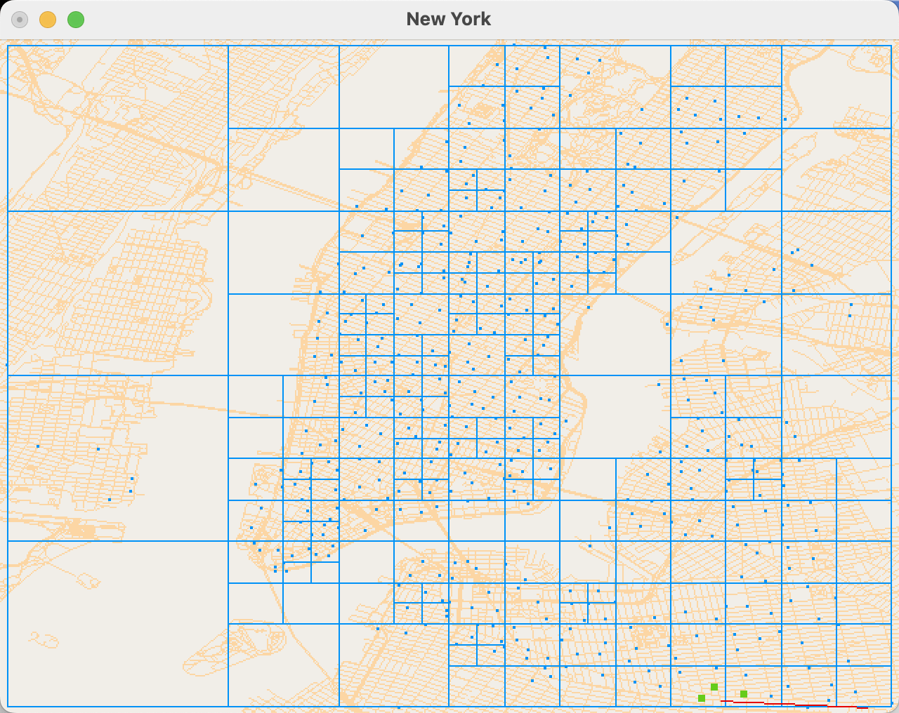
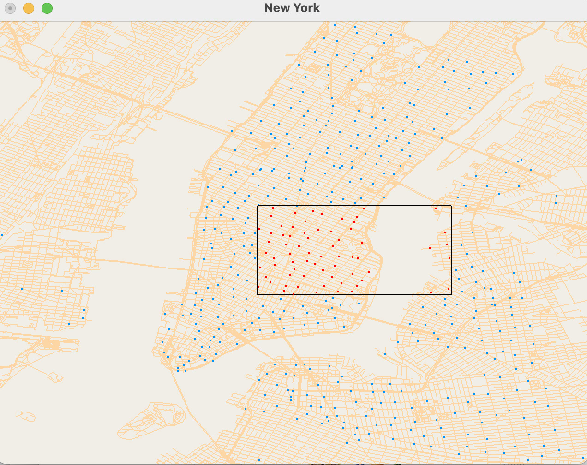

# Spatial Index Realization

 

Understand the hierarchy of spatial data types, familiarize oneself with the role of bounding boxes (Envelopes) in spatial queries, be acquainted with common spatial calculation methods, master the creation of Quad-trees and R-Trees, grasp methods for area queries and nearest neighbor queries, and comprehend the filtering and refining steps in spatial data queries."

## Content

1. **Based on the provided hierarchy of spatial data types including Geometry, Point, LineString (polyline), and Polygon, implement the calculation of Euclidean distance from a Point to both LineString and Polygon.**

2. **Based on the provided Envelope class, complete the functions for contain, intersect, and unionEnvelope.**

3. **Implement the creation and querying of a QuadTree based on the provided QuadNode and QuadTree classes, completing the following functionalities:**

   1. Implement the **constructQuadTree** and split functions to create a QuadTree.
      - For QuadTree creation, input a set of geometric features, divide the node into four subnodes, each feature is added to the child nodes that overlap with the bounding box (i.e., a feature may be in multiple nodes), delete the current node's geometric feature records (i.e., all features are only stored in leaf nodes), if the number of geometric features in a child node exceeds capacity, recursively generate subnodes.

   2. Implement the **rangeQuery** function for area queries.

      

      - For area queries, input the query area rect, query the geometric features intersecting with the query area rect, and store them in features. If the query area rect intersects with the current node's bounding box bbox, recursively traverse the QuadTree, querying which geometric features' bounding boxes intersect with the query area (filter); after obtaining the candidate geometric features that might intersect with the query area, precisely determine if the geometric features intersect with the query area (refinement).
      - Verify area queries on site and road data through mouse selection of the query area.

   3. Implement the **NNQuery** and pointInLeafNode functions for nearest geometric feature queries.
      - For nearest geometric feature query (NN), input the query point (x, y), return the geometric feature nearest to the point, and store it in feature.
      - Verify the nearest geometric feature query with the geometric features (sites and roads) nearest to the mouse by moving the mouse.

   4. **Spatial Join based on distance**
      - For spatial join based on distance, input the QuadTrees of two types of geometric features and the spatial distance constraint condition, output all geometric feature pairs that meet the spatial distance condition, verified through public bicycle stations and roads.

4. Creation and querying of **R-Tree**, completing the following functionalities:

   1. **R-Tree creation**
      - R-Tree construction can be done by inserting geometric features one by one, choosing nodes based on the principle that the smallest increase in node area is preferred, when exceeding the maximum number of geometric features a node can store, use the quadratic split algorithm, select the leftmost and rightmost two geometric features as seed points, and group the geometric features. To maintain the balance of the R-Tree, it is recommended to randomly select geometric features for insertion, or adjust the R-Tree structure after insertion like an AVL tree. The R-Tree can also be constructed using a recursive method similar to a QuadTree.

   2. **Range Query**

   3. **Nearest Neighbor Query**

   4. Spatial Join based on distance

5. Additional

   1. Enhance the functionality of the spatial data type hierarchy

      - Implement storage of **inner geometric data for Polygon** and modify the Euclidean distance calculation from Point to Polygon

      - Implement the **Euclidean distance calculation from LineString to LineString and Polygon**

      - Implement **MultiPoint, MultiLineString, and MultiPolygon** classes

   2. **Spatial querying of polygon data**
      - Implement the intersects function for Polygon and Envelope intersection determination
      - Implement area queries, nearest neighbor queries, and spatial join based on distance for polygon data
      
   3. **Performance analysis**
      - QuadTree performance analysis
      - Analyze QuadTree performance using New York taxi pickup point data. The performance of a QuadTree depends on the parameter capacity, i.e., the maximum number of geometric features per leaf node, too many values mean too many checks per leaf node, too few values mean too high tree levels. When capacity is between [70, 200], calculate the height of the QuadTree and the number of leaf nodes, evaluate the time for 100,000 random nearest geometric feature queries. Analyze the performance under different parameters, what conclusions can be drawn?
      - The data directory provides data on New York City roads (highway), bicycle stations (station), and taxi pickup and dropoff locations (taxi), analyze the performance differences of QuadTree, R-Tree, etc., under different data.